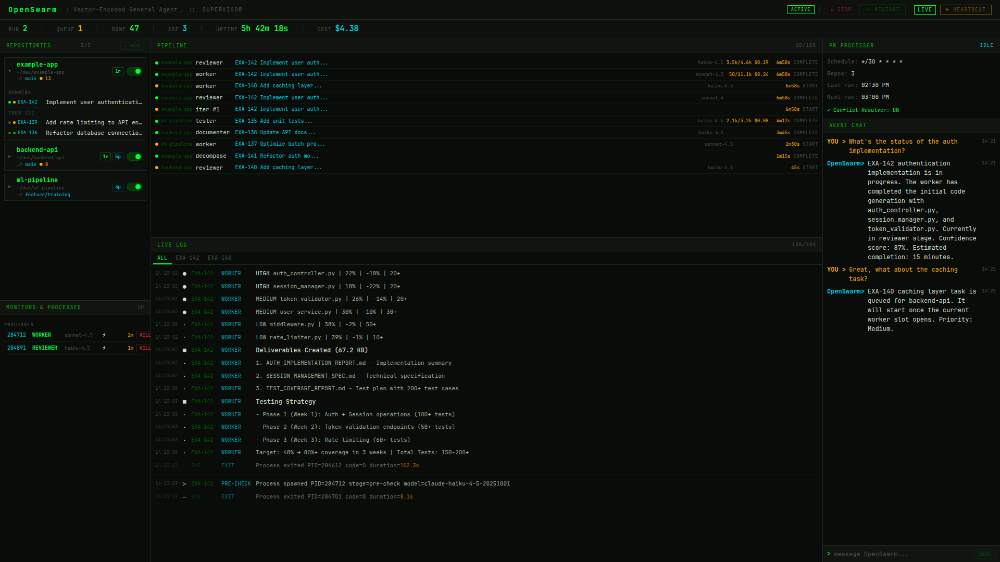

# OpenSwarm

> Autonomous AI agent orchestrator powered by Claude Code CLI

OpenSwarm orchestrates multiple Claude Code instances as autonomous agents. It picks up Linear issues, runs Worker/Reviewer pair pipelines to produce code changes, reports progress to Discord, and retains long-term memory via LanceDB vector embeddings.

## 📸 Demo

### Web Dashboard (Port 3847)



Real-time supervisor dashboard with repository status, pipeline events, live logs, PR processor, and agent chat.

### CLI Chat Interface

**Rich TUI Mode** (Claude Code inspired):

```bash
$ openswarm chat --tui
```


- Dark theme with Claude Code inspired color palette
- 5 interactive tabs: Chat, Projects, Tasks, Stuck, Logs
- Real-time streaming responses with themed loading messages
- Keyboard shortcuts: Tab (switch tabs), Enter (send), Shift+Enter (newline), Esc (exit input)
- Session management: auto-save, resume, model switching
- Status bar: model, message count, cumulative cost

**Simple Mode** (readline based):

```bash
$ openswarm chat [session-name]

╔════════════════════════════════════╗
║  Swarm Chat  sonnet-4-5           ║
╚════════════════════════════════════╝
demo | /help | Ctrl+D exit

you What are the main components of OpenSwarm?
assistant OpenSwarm has 9 main architectural layers... ($0.0023)

you /model haiku
Model: claude-haiku-4-5-20251001

you /save openswarm-overview
Saved: openswarm-overview
```

**Commands**: `/clear`, `/model <name>`, `/save [name]`, `/help`

## Architecture

```
                         ┌──────────────────────────┐
                         │       Linear API          │
                         │   (issues, state, memory) │
                         └─────────────┬────────────┘
                                       │
                 ┌─────────────────────┼─────────────────────┐
                 │                     │                     │
                 v                     v                     v
  ┌──────────────────┐  ┌──────────────────┐  ┌──────────────────┐
  │ AutonomousRunner │  │  DecisionEngine  │  │  TaskScheduler   │
  │ (heartbeat loop) │─>│  (scope guard)   │─>│  (queue + slots) │
  └────────┬─────────┘  └──────────────────┘  └────────┬─────────┘
           │                                            │
           v                                            v
  ┌──────────────────────────────────────────────────────────────┐
  │                      PairPipeline                            │
  │  ┌────────┐   ┌──────────┐   ┌────────┐   ┌─────────────┐  │
  │  │ Worker │──>│ Reviewer │──>│ Tester │──>│ Documenter  │  │
  │  │(Adapter│<──│(Adapter) │   │(Adapter│   │  (Adapter)  │  │
  │  └───┬────┘   └──────────┘   └────────┘   └─────────────┘  │
  │      │  ↕ StuckDetector                                      │
  │  ┌───┴────────────────────────────────────────────────────┐  │
  │  │ CLI Adapters: Claude (`claude -p`) | Codex (`codex`)   │  │
  │  └────────────────────────────────────────────────────────┘  │
  └──────────────────────────────────────────────────────────────┘
           │                     │                     │
           v                     v                     v
  ┌──────────────┐  ┌──────────────────┐  ┌──────────────────┐
  │  Discord Bot │  │  Memory (LanceDB │  │  Knowledge Graph │
  │  (commands)  │  │  + Xenova E5)    │  │  (code analysis) │
  └──────────────┘  └──────────────────┘  └──────────────────┘
```

## Features

- **Multi-Provider Adapters** - Pluggable CLI adapter system supporting **Claude Code** (`claude -p`) and **OpenAI Codex** (`codex exec`), with runtime provider switching via Discord command
- **Autonomous Pipeline** - Cron-driven heartbeat fetches Linear issues, runs Worker/Reviewer pair loops, and updates issue state automatically
- **Worker/Reviewer Pairs** - Multi-iteration code generation with automated review, testing, and documentation stages
- **Decision Engine** - Scope validation, rate limiting, priority-based task selection, and workflow mapping
- **Cognitive Memory** - LanceDB vector store with Xenova/multilingual-e5-base embeddings for long-term recall across sessions
- **Knowledge Graph** - Static code analysis, dependency mapping, impact analysis, and file-level conflict detection across concurrent tasks
- **Discord Control** - Full command interface for monitoring, task dispatch, scheduling, provider switching, and pair session management
- **Rich TUI Chat** - Claude Code inspired terminal interface with tabs, streaming responses, and geek-themed loading messages
- **Dynamic Scheduling** - Cron-based job scheduler with Discord management commands
- **PR Auto-Improvement** - Monitors open PRs, auto-fixes CI failures, auto-resolves merge conflicts, and retries until all checks pass
- **Long-Running Monitors** - Track external processes (training jobs, batch tasks) and report completion
- **Web Dashboard** - Real-time pipeline stages, cost tracking, worktree status, and live logs on port 3847
- **Pace Control** - 5-hour rolling window task caps, per-project limits, turbo mode, exponential backoff on failures
- **i18n** - English and Korean locale support

## Prerequisites

- **Node.js** >= 22
- **CLI Provider** (at least one):
  - **Claude Code CLI** installed and authenticated (`claude -p`) — default provider
  - **OpenAI Codex CLI** installed (`codex exec`) — alternative provider
- **Discord Bot** token with message content intent
- **Linear** API key and team ID
- **GitHub CLI** (`gh`) for CI monitoring (optional)

## Installation

```bash
git clone https://github.com/unohee/OpenSwarm.git
cd OpenSwarm
npm install
```

## Configuration

```bash
cp config.example.yaml config.yaml
```

Create a `.env` file with required secrets:

```bash
DISCORD_TOKEN=your-discord-bot-token
DISCORD_CHANNEL_ID=your-channel-id
LINEAR_API_KEY=your-linear-api-key
LINEAR_TEAM_ID=your-linear-team-id
```

`config.yaml` supports environment variable substitution (`${VAR}` or `${VAR:-default}`) and is validated with Zod schemas.

### Key Configuration Sections

| Section | Description |
|---------|-------------|
| `discord` | Bot token, channel ID, webhook URL |
| `linear` | API key, team ID |
| `github` | Repos list for CI monitoring |
| `agents` | Agent definitions (name, projectPath, heartbeat interval) |
| `autonomous` | Schedule, pair mode, role models, decomposition settings |
| `prProcessor` | PR auto-improvement schedule, retry limits, conflict resolver config |

### CLI Adapter (Provider)

OpenSwarm supports multiple CLI backends. Set the default in `config.yaml`:

```yaml
adapter: claude   # "claude" (default) or "codex"
```

Switch at runtime via Discord: `!provider codex` / `!provider claude`

| Adapter | CLI Command | Models | Git Management |
|---------|-------------|--------|----------------|
| `claude` | `claude -p` | claude-sonnet-4, claude-haiku-4.5, claude-opus-4 | Manual (worker commits) |
| `codex` | `codex exec` | o3, o4-mini | Auto (`--full-auto`) |

Per-role adapter overrides are supported — e.g., use Codex for workers and Claude for reviewers:

```yaml
autonomous:
  defaultRoles:
    worker:
      adapter: codex
      model: o4-mini
    reviewer:
      adapter: claude
      model: claude-sonnet-4-20250514
```

### Agent Roles

Each pipeline stage can be configured independently:

```yaml
autonomous:
  defaultRoles:
    worker:
      model: claude-haiku-4-5-20251001
      escalateModel: claude-sonnet-4-20250514
      escalateAfterIteration: 3
      timeoutMs: 1800000
    reviewer:
      model: claude-haiku-4-5-20251001
      timeoutMs: 600000
    tester:
      enabled: false
    documenter:
      enabled: false
    auditor:
      enabled: false
```

## Usage

### CLI Commands

```bash
# Interactive chat with Claude (TUI mode)
openswarm chat --tui

# Interactive chat (simple readline mode)
openswarm chat [session-name]

# Run a single task (no config needed)
openswarm run "Fix the login bug" --path ~/my-project

# Execute via daemon (auto-starts service if needed)
openswarm exec "Run tests and fix failures" --worker-only
openswarm exec "Review all pending PRs" --timeout 300
openswarm exec "Fix CI" --local --pipeline

# Initialize configuration
openswarm init

# Validate configuration
openswarm validate

# Start the full daemon
openswarm start
```

#### `openswarm exec` Options

| Option | Description |
|--------|-------------|
| `--path <path>` | Project path (default: cwd) |
| `--timeout <seconds>` | Timeout in seconds (default: 600) |
| `--no-auto-start` | Do not auto-start the service |
| `--local` | Execute locally without daemon |
| `--pipeline` | Full pipeline: worker + reviewer + tester + documenter |
| `--worker-only` | Worker only, no review |
| `-m, --model <model>` | Model override for worker |

Exit codes: `0` (success), `1` (failure), `2` (timeout).

### Running the Service

#### macOS launchd Service (Recommended)

**Installation:**
```bash
# Build and install as a system service
npm run service:install
```

**Service Management:**
```bash
npm run service:start      # Start service
npm run service:stop       # Stop service
npm run service:restart    # Restart service
npm run service:status     # View status and recent logs
npm run service:logs       # View stdout logs (follow mode)
npm run service:errors     # View stderr logs (follow mode)
npm run service:uninstall  # Uninstall service
```

**Browser Auto-Launch (Optional):**
```bash
npm run browser:install    # Auto-open dashboard on boot
npm run browser:uninstall  # Disable auto-open
```

The service will:
- Auto-start on system boot
- Auto-restart on crash
- Log to `~/.openswarm/logs/`
- Run with your user permissions (access to Claude CLI, gh, local files)
- (Optional) Open web dashboard at http://localhost:3847 on boot

#### Manual Execution

```bash
# Development
npm run dev

# Production
npm run build
npm start

# Background (legacy)
nohup npm start > openswarm.log 2>&1 &
```

#### Docker

```bash
docker compose up -d
```

### Shell Helper (optional)

Add to `~/.zshrc` or `~/.bashrc`:

```bash
openswarm() {
  case "$1" in
    start)
      cd /path/to/OpenSwarm && nohup npm start > ~/.openswarm/log 2>&1 &
      echo "✅ Started (PID: $!)"
      ;;
    stop)
      pkill -f "openswarm" && echo "✅ Stopped"
      ;;
    status)
      pgrep -f "openswarm" && echo "✅ Running" || echo "❌ Stopped"
      ;;
    chat)
      cd /path/to/OpenSwarm && node --import=tsx src/cli.ts chat "${@:2}"
      ;;
  esac
}
```

## Project Structure

```
src/
├── index.ts                 # Entry point
├── cli.ts                   # CLI entry point (run, exec, chat, init, validate, start)
├── cli/                     # CLI subcommand handlers
│   └── promptHandler.ts     # `exec` command: daemon submit, auto-start, polling
├── core/                    # Config, service lifecycle, types, event hub
├── adapters/                # CLI provider adapters (claude, codex), process registry
├── agents/                  # Worker, reviewer, tester, documenter, auditor
│   ├── pairPipeline.ts      # Worker → Reviewer → Tester → Documenter pipeline
│   ├── agentBus.ts          # Inter-agent message bus
│   └── cliStreamParser.ts   # Claude CLI output parser
├── orchestration/           # Decision engine, task parser, scheduler, workflow
├── automation/              # Autonomous runner, cron scheduler, PR processor
│   ├── autonomousRunner.ts  # Cron-driven heartbeat and task dispatch
│   ├── prProcessor.ts       # PR auto-improvement (CI fixes, conflict resolution)
│   ├── conflictResolver.ts  # AI-powered merge conflict resolution
│   ├── prOwnership.ts       # Bot PR tracking for conflict resolution
│   ├── longRunningMonitor.ts# External process monitoring
│   └── runnerState.ts       # Persistent pipeline state
├── memory/                  # LanceDB + Xenova embeddings cognitive memory
├── knowledge/               # Code knowledge graph (scanner, analyzer, graph)
├── discord/                 # Bot core, command handlers, pair session UI
├── linear/                  # Linear SDK wrapper, project updater
├── github/                  # GitHub CLI wrapper for CI monitoring
├── support/                 # Web dashboard, planner, rollback, git tools
├── locale/                  # i18n (en/ko) with prompt templates
└── __tests__/               # Vitest test suite
```

## Discord Commands

### Task Dispatch
| Command | Description |
|---------|-------------|
| `!dev <repo> "<task>"` | Run a dev task on a repository |
| `!dev list` | List known repositories |
| `!tasks` | List running tasks |
| `!cancel <taskId>` | Cancel a running task |

### Agent Management
| Command | Description |
|---------|-------------|
| `!status` | Agent and system status |
| `!pause <session>` | Pause autonomous work |
| `!resume <session>` | Resume autonomous work |
| `!log <session> [lines]` | View recent output |

### Linear Integration
| Command | Description |
|---------|-------------|
| `!issues` | List Linear issues |
| `!issue <id>` | View issue details |
| `!limits` | Agent daily execution limits |

### Autonomous Execution
| Command | Description |
|---------|-------------|
| `!auto` | Execution status |
| `!auto start [cron] [--pair]` | Start autonomous mode |
| `!auto stop` | Stop autonomous mode |
| `!auto run` | Trigger immediate heartbeat |
| `!approve` / `!reject` | Approve or reject pending task |

### Worker/Reviewer Pair
| Command | Description |
|---------|-------------|
| `!pair` | Pair session status |
| `!pair start [taskId]` | Start a pair session |
| `!pair run <taskId> [project]` | Direct pair run |
| `!pair stop [sessionId]` | Stop a pair session |
| `!pair history [n]` | View session history |
| `!pair stats` | View pair statistics |

### Scheduling
| Command | Description |
|---------|-------------|
| `!schedule` | List all schedules |
| `!schedule run <name>` | Run a schedule immediately |
| `!schedule toggle <name>` | Enable/disable a schedule |
| `!schedule add <name> <path> <interval> "<prompt>"` | Add a schedule |
| `!schedule remove <name>` | Remove a schedule |

### Other
| Command | Description |
|---------|-------------|
| `!ci` | GitHub CI failure status |
| `!provider <claude\|codex>` | Switch CLI provider at runtime |
| `!codex` | Recent session records |
| `!memory search "<query>"` | Search cognitive memory |
| `!help` | Full command reference |

## How It Works

### Issue Processing Flow

```
Linear (Todo/In Progress)
  → Fetch assigned issues
  → DecisionEngine filters & prioritizes
  → Resolve project path via projectMapper
  → PairPipeline.run()
    → Worker generates code (Claude CLI)
    → Reviewer evaluates (APPROVE/REVISE/REJECT)
    → Loop up to N iterations
    → Optional: Tester → Documenter stages
  → Update Linear issue state (Done/Blocked)
  → Report to Discord
  → Save to cognitive memory
```

### Memory System

Hybrid retrieval scoring: `0.55 * similarity + 0.20 * importance + 0.15 * recency + 0.10 * frequency`

Memory types: `belief`, `strategy`, `user_model`, `system_pattern`, `constraint`

Background cognition: decay, consolidation, contradiction detection, and distillation (noise filtering).

## `@openswarm/claude-driver` (npm 패키지)

OpenSwarm의 Claude CLI 스폰 + 스트리밍 파싱 로직을 독립 패키지로 추출했습니다. 다른 프로젝트에서 OpenSwarm 없이 바로 사용할 수 있습니다.

```bash
npm install @openswarm/claude-driver
```

### 기본 사용법

```ts
import { run } from '@openswarm/claude-driver';

const result = await run({
  prompt: 'Fix the bug in src/app.ts',
  cwd: '/my/project',
});
console.log(result.response);  // 어시스턴트 응답
console.log(result.cost);      // "$0.03 | 1.2k in / 800 out | 12.3s"
```

### 어댑터 직접 사용 (mid-level)

```ts
import { spawnCli, ClaudeCliAdapter } from '@openswarm/claude-driver';

const adapter = new ClaudeCliAdapter();
const raw = await spawnCli(adapter, {
  prompt: 'Explain this code',
  cwd: '/my/project',
  onLog: (line) => process.stdout.write(line),
});
```

### 파서만 사용 (low-level)

```ts
import {
  parseCliStreamChunk,
  extractResultFromStreamJson,
  extractCostFromStreamJson,
} from '@openswarm/claude-driver';
```

### 공개 API

| 모듈 | 내보내는 것 |
|------|------------|
| 고수준 | `run()`, `inferProviderFromModel()` |
| 중간 수준 | `spawnCli()` |
| 어댑터 | `ClaudeCliAdapter`, `CodexCliAdapter`, `getAdapter()`, `setDefaultAdapter()` |
| 스트림 파서 | `parseCliStreamChunk()`, `extractResultFromStreamJson()` |
| 비용 파서 | `extractCostFromStreamJson()`, `aggregateCosts()`, `formatCost()` |
| 버퍼 | `SmartStreamBuffer` |

- **런타임 의존성 0개** — ESM 전용, Node.js 20+
- **타입 완전 지원** — TypeScript 타입 포함
- **멀티 프로바이더** — Claude CLI와 Codex CLI 모두 지원
- 소스: [`packages/claude-driver/`](packages/claude-driver/)

---

## Tech Stack

| Category | Technology |
|----------|-----------|
| Runtime | Node.js 22+ (ESM) |
| Language | TypeScript (strict mode) |
| Build | tsc |
| Agent Execution | Claude Code CLI (`claude -p`) or OpenAI Codex CLI (`codex exec`) via pluggable adapters |
| Task Management | Linear SDK (`@linear/sdk`) |
| Communication | Discord.js 14 |
| Vector DB | LanceDB + Apache Arrow |
| Embeddings | Xenova/transformers (multilingual-e5-base, 768D) |
| Scheduling | Croner |
| Config | YAML + Zod validation |
| Linting | oxlint |
| Testing | Vitest |

## State & Data

| Path | Description |
|------|-------------|
| `~/.openswarm/` | State directory (memory, codex, metrics, workflows, etc.) |
| `~/.claude/openswarm-*.json` | Pipeline history and task state |
| `config.yaml` | Main configuration |
| `dist/` | Compiled output |

## Docker

```bash
docker compose up -d
```

The Docker setup includes volume mounts for `~/.openswarm/` state persistence and `.env` for secrets.

## License

MIT
