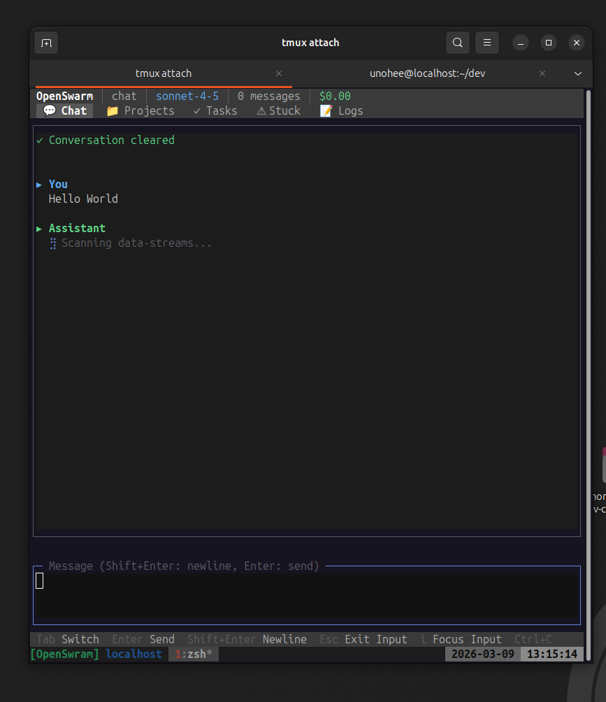

# OpenSwarm

[](https://www.npmjs.com/package/@intrect/openswarm)
[](https://www.npmjs.com/package/@intrect/openswarm)
[](LICENSE)

> Autonomous AI agent orchestrator — Claude, GPT, Codex, and local models (Ollama/LMStudio/llama.cpp)

OpenSwarm orchestrates multiple AI agents as autonomous code workers. It picks up Linear issues, runs Worker/Reviewer pair pipelines, reports to Discord, and retains long-term memory via LanceDB. Supports Claude Code, OpenAI GPT, Codex, and **local open-source models** via Ollama, LMStudio, or llama.cpp.

## Quick Start

```bash
npm install -g @intrect/openswarm
openswarm
```

That's it. `openswarm` with no arguments launches the TUI chat interface immediately.



### TUI keyboard shortcuts

| Key | Action |
|-----|--------|
| `Tab` | Switch tabs (Chat / Projects / Tasks / Stuck / Logs) |
| `Enter` | Send message |
| `Shift+Enter` | Newline |
| `i` | Focus input |
| `Esc` | Exit input focus |
| `Ctrl+C` | Quit |

Status bar shows: provider · model · message count · cumulative cost

---

## CLI Commands

```bash
openswarm                        # TUI chat (default)
openswarm chat [session]         # Simple readline chat
openswarm start                  # Start full daemon (requires config.yaml)
openswarm run "Fix the bug" -p ~/my-project   # Run a single task
openswarm exec "Run tests" --local --pipeline # Execute via daemon
openswarm init                   # Generate config.yaml scaffold
openswarm validate               # Validate config.yaml

# Code Registry & BS Detector
openswarm check --scan           # Scan repo → register all entities
openswarm check src/foo.ts       # File brief (entities, tests, risk)
openswarm check --bs             # BS pattern scan (bad code smells)
openswarm check --stats          # Registry statistics
openswarm check --high-risk      # High-risk entities
openswarm check --search "name"  # Full-text search
openswarm annotate "funcName" --deprecate "reason"
openswarm annotate "funcName" --tag "needs-refactor"
openswarm annotate "funcName" --warn "error/security: SQL injection"
```

### `openswarm exec` options

| Option | Description |
|--------|-------------|
| `--path <path>` | Project path (default: cwd) |
| `--timeout <seconds>` | Timeout in seconds (default: 600) |
| `--local` | Execute locally without daemon |
| `--pipeline` | Full pipeline: worker + reviewer + tester + documenter |
| `--worker-only` | Worker only, no review |
| `-m, --model <model>` | Model override for worker |

Exit codes: `0` success · `1` failure · `2` timeout

---

## Full Daemon Setup

For autonomous operation (Linear issue processing, Discord control, PR auto-improvement), you need a full config:

### Prerequisites

- **Node.js** >= 22
- **Claude Code CLI** authenticated (`claude -p`) — default provider
- **OpenAI Codex CLI** (`codex exec`) — optional alternative provider
- **Discord Bot** token with message content intent
- **Linear** API key and team ID
- **GitHub CLI** (`gh`) for CI monitoring (optional)

### Configuration

```bash
git clone https://github.com/unohee/OpenSwarm.git
cd OpenSwarm
npm install
cp config.example.yaml config.yaml
```

Create a `.env` file:

```bash
DISCORD_TOKEN=your-discord-bot-token
DISCORD_CHANNEL_ID=your-channel-id
LINEAR_API_KEY=your-linear-api-key
LINEAR_TEAM_ID=your-linear-team-id
```

`config.yaml` supports `${VAR}` / `${VAR:-default}` substitution and is validated with Zod schemas.

### Key configuration sections

| Section | Description |
|---------|-------------|
| `discord` | Bot token, channel ID, webhook URL |
| `linear` | API key, team ID |
| `github` | Repos list for CI monitoring |
| `agents` | Agent definitions (name, projectPath, heartbeat interval) |
| `autonomous` | Schedule, pair mode, role models, decomposition settings |
| `prProcessor` | PR auto-improvement schedule, retry limits, conflict resolver config |

### CLI Adapter (Provider)

```yaml
adapter: claude   # "claude" | "codex" | "gpt" | "local"
```

Switch at runtime via Discord: `!provider codex` / `!provider claude`

| Adapter | Backend | Models | Auth |
|---------|---------|--------|------|
| `claude` | Claude Code CLI | sonnet-4, haiku-4.5, opus-4 | CLI auth |
| `codex` | OpenAI Codex CLI | o3, o4-mini | CLI auth |
| `gpt` | OpenAI API | gpt-4o, o3, gpt-4.1 | OAuth PKCE |
| `local` | Ollama / LMStudio / llama.cpp | gemma4, llama3, mistral, qwen, etc. | None |

Local models are auto-detected on standard ports (Ollama `:11434`, LMStudio `:1234`, llama.cpp `:8080`).

Per-role adapter overrides:

```yaml
autonomous:
  defaultRoles:
    worker:
      adapter: codex
      model: o4-mini
    reviewer:
      adapter: claude
      model: claude-sonnet-4-20250514
```

### Agent Roles

```yaml
autonomous:
  defaultRoles:
    worker:
      model: claude-haiku-4-5-20251001
      escalateModel: claude-sonnet-4-20250514
      escalateAfterIteration: 3
      timeoutMs: 1800000
    reviewer:
      model: claude-haiku-4-5-20251001
      timeoutMs: 600000
    tester:
      enabled: false
    documenter:
      enabled: false
    auditor:
      enabled: false
```

### Running the daemon

#### macOS launchd service (recommended)

```bash
npm run service:install    # Build and install as system service
npm run service:start      # Start
npm run service:stop       # Stop
npm run service:restart    # Restart
npm run service:status     # Status and recent logs
npm run service:logs       # stdout (follow mode)
npm run service:errors     # stderr (follow mode)
npm run service:uninstall  # Uninstall
```

#### Manual

```bash
npm run build && npm start   # Production
npm run dev                  # Development (tsx watch)
docker compose up -d         # Docker
```

---

## Architecture

```
                         ┌──────────────────────────┐
                         │       Linear API          │
                         │   (issues, state, memory) │
                         └─────────────┬────────────┘
                                       │
                 ┌─────────────────────┼─────────────────────┐
                 │                     │                     │
                 v                     v                     v
  ┌──────────────────┐  ┌──────────────────┐  ┌──────────────────┐
  │ AutonomousRunner │  │  DecisionEngine  │  │  TaskScheduler   │
  │ (heartbeat loop) │─>│  (scope guard)   │─>│  (queue + slots) │
  └────────┬─────────┘  └──────────────────┘  └────────┬─────────┘
           │                                            │
           v                                            v
  ┌──────────────────────────────────────────────────────────────┐
  │                      PairPipeline                            │
  │  ┌────────┐   ┌──────────┐   ┌────────┐   ┌─────────────┐  │
  │  │ Worker │──>│ Reviewer │──>│ Tester │──>│ Documenter  │  │
  │  │(Adapter│<──│(Adapter) │   │(Adapter│   │  (Adapter)  │  │
  │  └───┬────┘   └──────────┘   └────────┘   └─────────────┘  │
  │      │  ↕ StuckDetector                                      │
  │  ┌───┴────────────────────────────────────────────────────┐  │
  │  │ Adapters: Claude | Codex | GPT | Local (Ollama/LMS)   │  │
  │  └────────────────────────────────────────────────────────┘  │
  └──────────────────────────────────────────────────────────────┘
           │                     │                     │
           v                     v                     v
  ┌──────────────┐  ┌──────────────────┐  ┌──────────────────┐
  │  Discord Bot │  │  Memory (LanceDB │  │  Knowledge Graph │
  │  (commands)  │  │  + Xenova E5)    │  │  (code analysis) │
  └──────────────┘  └──────────────────┘  └────────┬─────────┘
                                                    │
                                           ┌────────┴─────────┐
                                           │  Code Registry   │
                                           │  (SQLite + FTS5) │
                                           │  + BS Detector   │
                                           └──────────────────┘
```

## Features

- **Multi-Provider Adapters** — Pluggable adapter system: **Claude Code**, **OpenAI GPT/Codex**, and **local models** (Ollama, LMStudio, llama.cpp) with runtime provider switching
- **Code Registry** — SQLite-backed entity registry tracking every function/class/type across 8 languages, with complexity scoring, test mapping, and risk assessment
- **BS Detector** — Built-in static analysis engine that detects bad code patterns (empty catch, hardcoded secrets, `as any`, etc.) with pipeline guard integration
- **Autonomous Pipeline** — Cron-driven heartbeat fetches Linear issues, runs Worker/Reviewer pair loops, and updates issue state automatically
- **Worker/Reviewer Pairs** — Multi-iteration code generation with automated review, testing, and documentation stages
- **Decision Engine** — Scope validation, rate limiting, priority-based task selection, and workflow mapping
- **Cognitive Memory** — LanceDB vector store with Xenova/multilingual-e5-base embeddings for long-term recall across sessions
- **Knowledge Graph** — Static code analysis, dependency mapping, impact analysis, and file-level conflict detection across concurrent tasks
- **Discord Control** — Full command interface for monitoring, task dispatch, scheduling, provider switching, and pair session management
- **Rich TUI Chat** — Claude Code inspired terminal interface with tabs, streaming responses, and geek-themed loading messages
- **Dynamic Scheduling** — Cron-based job scheduler with Discord management commands
- **PR Auto-Improvement** — Monitors open PRs, auto-fixes CI failures, auto-resolves merge conflicts, and retries until all checks pass
- **Long-Running Monitors** — Track external processes (training jobs, batch tasks) and report completion
- **Web Dashboard** — Real-time pipeline stages, cost tracking, worktree status, and live logs on port 3847
- **Pace Control** — 5-hour rolling window task caps, per-project limits, turbo mode, exponential backoff on failures
- **i18n** — English and Korean locale support

---

## How It Works

```
Linear (Todo/In Progress)
  → Fetch assigned issues
  → DecisionEngine filters & prioritizes
  → Resolve project path via projectMapper
  → PairPipeline.run()
    → Worker generates code (Claude CLI)
    → Reviewer evaluates (APPROVE/REVISE/REJECT)
    → Loop up to N iterations
    → Optional: Tester → Documenter stages
  → Update Linear issue state (Done/Blocked)
  → Report to Discord
  → Save to cognitive memory
```

### Memory System

Hybrid retrieval: `0.55 × similarity + 0.20 × importance + 0.15 × recency + 0.10 × frequency`

Memory types: `belief` · `strategy` · `user_model` · `system_pattern` · `constraint`

Background: decay, consolidation, contradiction detection, distillation.

---

## Discord Commands

### Task Dispatch
| Command | Description |
|---------|-------------|
| `!dev <repo> "<task>"` | Run a dev task on a repository |
| `!dev list` | List known repositories |
| `!tasks` | List running tasks |
| `!cancel <taskId>` | Cancel a running task |

### Agent Management
| Command | Description |
|---------|-------------|
| `!status` | Agent and system status |
| `!pause <session>` | Pause autonomous work |
| `!resume <session>` | Resume autonomous work |
| `!log <session> [lines]` | View recent output |

### Linear Integration
| Command | Description |
|---------|-------------|
| `!issues` | List Linear issues |
| `!issue <id>` | View issue details |
| `!limits` | Agent daily execution limits |

### Autonomous Execution
| Command | Description |
|---------|-------------|
| `!auto` | Execution status |
| `!auto start [cron] [--pair]` | Start autonomous mode |
| `!auto stop` | Stop autonomous mode |
| `!auto run` | Trigger immediate heartbeat |
| `!approve` / `!reject` | Approve or reject pending task |

### Worker/Reviewer Pair
| Command | Description |
|---------|-------------|
| `!pair` | Pair session status |
| `!pair start [taskId]` | Start a pair session |
| `!pair run <taskId> [project]` | Direct pair run |
| `!pair stop [sessionId]` | Stop a pair session |
| `!pair history [n]` | View session history |
| `!pair stats` | View pair statistics |

### Scheduling
| Command | Description |
|---------|-------------|
| `!schedule` | List all schedules |
| `!schedule run <name>` | Run a schedule immediately |
| `!schedule toggle <name>` | Enable/disable a schedule |
| `!schedule add <name> <path> <interval> "<prompt>"` | Add a schedule |
| `!schedule remove <name>` | Remove a schedule |

### Other
| Command | Description |
|---------|-------------|
| `!ci` | GitHub CI failure status |
| `!provider <claude\|codex>` | Switch CLI provider at runtime |
| `!codex` | Recent session records |
| `!memory search "<query>"` | Search cognitive memory |
| `!help` | Full command reference |

---

## Project Structure

```
src/
├── index.ts                 # Entry point
├── cli.ts                   # CLI entry point (run, exec, chat, init, validate, start)
├── cli/                     # CLI subcommand handlers
│   └── promptHandler.ts     # exec command: daemon submit, auto-start, polling
├── core/                    # Config, service lifecycle, types, event hub
├── adapters/                # CLI provider adapters (claude, codex, gpt, local), process registry
├── agents/                  # Worker, reviewer, tester, documenter, auditor
│   ├── pairPipeline.ts      # Worker → Reviewer → Tester → Documenter pipeline
│   ├── agentBus.ts          # Inter-agent message bus
│   └── cliStreamParser.ts   # Claude CLI output parser
├── orchestration/           # Decision engine, task parser, scheduler, workflow
├── automation/              # Autonomous runner, cron scheduler, PR processor
├── memory/                  # LanceDB + Xenova embeddings cognitive memory
├── knowledge/               # Code knowledge graph (scanner, analyzer, graph)
├── registry/                # Code entity registry, BS detector, entity scanner
├── issues/                  # Local issue tracker (SQLite + GraphQL + Kanban UI)
├── discord/                 # Bot core, command handlers, pair session UI
├── linear/                  # Linear SDK wrapper, project updater
├── github/                  # GitHub CLI wrapper for CI monitoring
├── support/                 # Web dashboard, planner, rollback, git tools
├── locale/                  # i18n (en/ko) with prompt templates
└── __tests__/               # Vitest test suite
```

## State & Data

| Path | Description |
|------|-------------|
| `~/.openswarm/` | State directory (memory, codex, metrics, workflows) |
| `~/.openswarm/registry.db` | Code entity registry (SQLite) |
| `~/.openswarm/issues.db` | Local issue tracker (SQLite) |
| `~/.claude/openswarm-*.json` | Pipeline history and task state |
| `config.yaml` | Main configuration |
| `dist/` | Compiled output |

---


## Tech Stack

| Category | Technology |
|----------|-----------|
| Runtime | Node.js 22+ (ESM) |
| Language | TypeScript (strict mode) |
| Build | tsc |
| Agent Execution | Claude Code, OpenAI GPT/Codex, Ollama/LMStudio/llama.cpp |
| Local DB | better-sqlite3 (WAL mode, FTS5) |
| Task Management | Linear SDK (`@linear/sdk`) |
| Communication | Discord.js 14 |
| Vector DB | LanceDB + Apache Arrow |
| Embeddings | Xenova/transformers (multilingual-e5-base, 768D) |
| Scheduling | Croner |
| Config | YAML + Zod validation |
| Linting | oxlint |
| Testing | Vitest |

---

## Changelog

### v0.3.0
- **Code Registry**: `openswarm check --scan` scans repo, registers 1000+ entities across 8 languages (TS, Python, Go, Rust, Java, C, C++, C#) with test mapping, complexity scoring, and risk assessment
- **BS Detector**: `openswarm check --bs` — built-in static analysis for bad code patterns, pipeline guard integration
- **Local Model Support**: Ollama, LMStudio, llama.cpp via single `local` adapter with auto-detection
- **GPT Adapter**: OpenAI models via OAuth PKCE flow
- **Local Issue Tracker**: SQLite + GraphQL + Kanban web UI at `:3847/issues`
- **CLI**: `openswarm check`, `openswarm annotate` commands

### v0.2.2
- `openswarm` without arguments now launches TUI chat directly

### v0.2.1
- Security: patched lodash, picomatch, rollup, undici, yaml vulnerabilities

### v0.2.0
- Published as `@intrect/openswarm` on npm
- Extracted `@intrect/claude-driver` as standalone zero-dependency package
- Autonomous runner hardening and multi-project orchestration
- Task-state rehydration from Linear comments
- `--verbose` flag for detailed execution logging
- Codex adapter: dropped o-series model override

### v0.1.0
- Initial release
- Worker/Reviewer pair pipeline
- Claude Code CLI + Codex CLI adapters
- Discord bot control
- Linear integration
- LanceDB cognitive memory
- Web dashboard (port 3847)
- Rich TUI chat interface

---

## License

MIT
